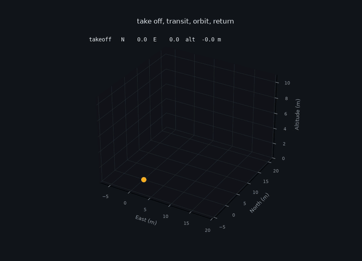
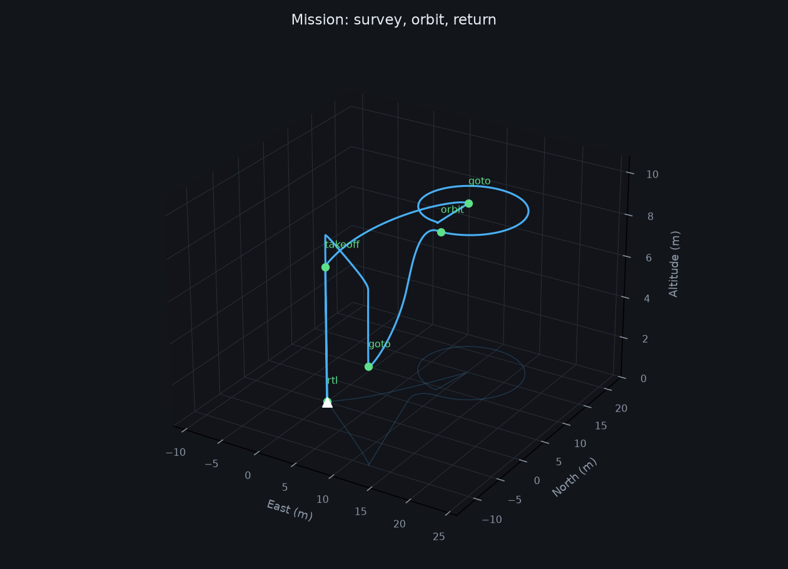

# llm-drone

**Fly a quadrotor by describing the mission in English — where the model is never allowed to touch the controls.**



```bash
python fly.py "take off to 8m, fly 15m north and 10m east, circle it, then come home"
```

```
takeoff  ok   climb to 8.0m     N=  0.0 E=  0.0 alt= 8.6   4.8s
goto     ok   18.0m leg         N= 14.8 E= 10.0 alt= 8.2   5.1s
orbit    ok   r=6.0m circle     N=  8.1 E= 10.5 alt= 8.0  13.2s
rtl      ok   touchdown         N= -0.1 E=  0.0 alt=-0.0   2.5s
```

---

## The problem

Language models are good at turning "survey the north field and come back" into a
plan. They are bad at everything that makes flight safe: they hallucinate
coordinates, emit `NaN`, invent units, and confidently produce a waypoint two
kilometres away.

The usual approach hands the model a tool that moves the vehicle. That means one
bad token reaches an actuator, and there is no layer whose job is to say no.

## The solution

The model never touches the controller. It emits **one JSON object from a closed
set of six verbs**, and everything it produces crosses a validation boundary
before anything moves:

```jsonc
{"verb": "goto", "north": 15, "east": 10, "altitude": 8, "speed": 5,
 "reason": "fly to the requested point"}
```

- **Structurally invalid → rejected.** Unknown verb, `null`, `NaN`, a boolean
  where a number belongs, unparseable JSON. The command is not flown, and the
  reason goes back to the planner so it can try again.
- **Out of range → clamped, not failed.** 200 m altitude becomes the 30 m
  ceiling; a 500 m waypoint is pulled back onto the geofence *along its own
  bearing*, so the intended direction survives. Every clamp is reported.
- **Unsafe is unrepresentable.** There is no verb for "descend below ground" and
  no way to express a waypoint outside the fence.

The planner is also handed the vehicle's **actual** state after every command, so
it replans against what happened rather than what it hoped would happen.

## Everything under it is written from scratch

No ROS, no Gazebo, no PX4. It is numpy and matplotlib, and it runs on a laptop.

| | |
|---|---|
| `drone/dynamics.py` | 6-DOF rigid body in NED, RK4 integration, X-quad mixer derived from `r × F` |
| `drone/control.py` | cascaded PID: position → acceleration → attitude → body moments → rotor speeds |
| `drone/commands.py` | the schema and the guard described above |
| `drone/mission.py` | executes verbs, detects arrival, logs the trajectory |
| `drone/planner.py` | LLM backend (OpenAI-compatible / Ollama) + an offline rule-based one |
| `drone/viz.py` | 3-D animation and trajectory plots |
| `tests/` | 24 tests, checked against closed-form physics |

## Three bugs worth keeping

**The tilt signs were inverted.** Commanded east, it flew 268 m west. Rather than
guess, the fix came from evaluating the rotation matrix: `+roll → +east`,
`+pitch → −north`. There's a test pinning it now.

**The mixer was degenerate.** Pitch and yaw were computed from the same rotor
combination, so pitch moment was *always exactly zero* and the vehicle could
only move on one axis. Re-deriving the layout from `r × F` made all four axes
independent — `test_mixer_axes_are_independent` is the test that would have
caught it.

**The control loops were fighting.** Hand-tuned attitude gains put the inner
loop at 3.35 rad/s and the outer at 1.18 rad/s. A cascade assumes the inner loop
is roughly a decade faster; at 3× they interfere, and the drone oscillated and
yawed 50° off heading. The attitude gains are now computed from the inertia
(`kp = I·ω²`, `kd = 2ζ√(kp·I)`) instead of guessed.

## Run it

```bash
pip install numpy matplotlib
python fly.py "take off to 6m and circle 10m north of here"

# save the flight
python fly.py "..." --video docs/flight.mp4 --plot docs/trajectory.png

# use a real model instead of the offline planner
export OPENAI_API_KEY=sk-...
python fly.py --llm "survey the area 20m north, then come home"
```

`--llm` works against any OpenAI-compatible endpoint — set `OPENAI_BASE_URL` to
point at a local Ollama server. Without a key it falls back to the rule-based
planner, so the repo runs and demos offline. Both backends emit the same JSON
and cross the same guard, which makes the scripted one a useful control when you
want to know whether a failure came from the model or from the flight code.

```bash
pytest tests/ -q      # 24 passed
```



<sub>Prior art: the LLM-commands-a-drone framing follows
[pratikPhadte/LLM-controlled-drone](https://github.com/pratikPhadte/LLM-controlled-drone),
which does it on ROS 2 + PX4 + Gazebo. This is an independent implementation
built to run without them.</sub>
